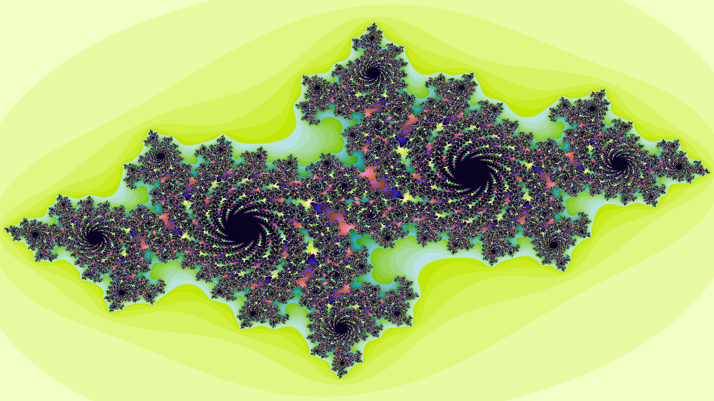
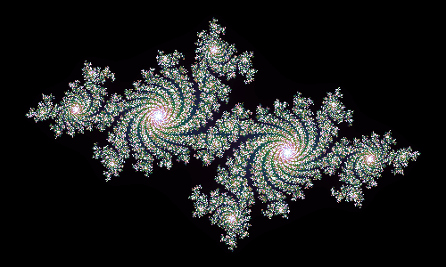
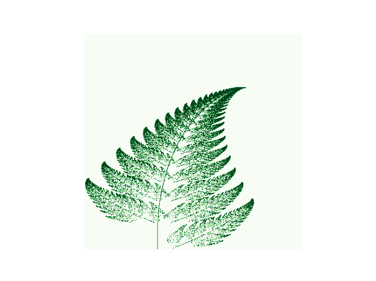

# Example output

<ul>
    <li>python geo.py</li>
</ul>

<ul>
    <li>python -m fractal julia -0.7102 +0.2698 j --size=500x300 --depth=512 --zoom=0.65 --show</li>
</ul>

<ul>
    <li>python leaves.py</li>
</ul>

<ul>
    <li>python FIC.py</li>
</ul>

